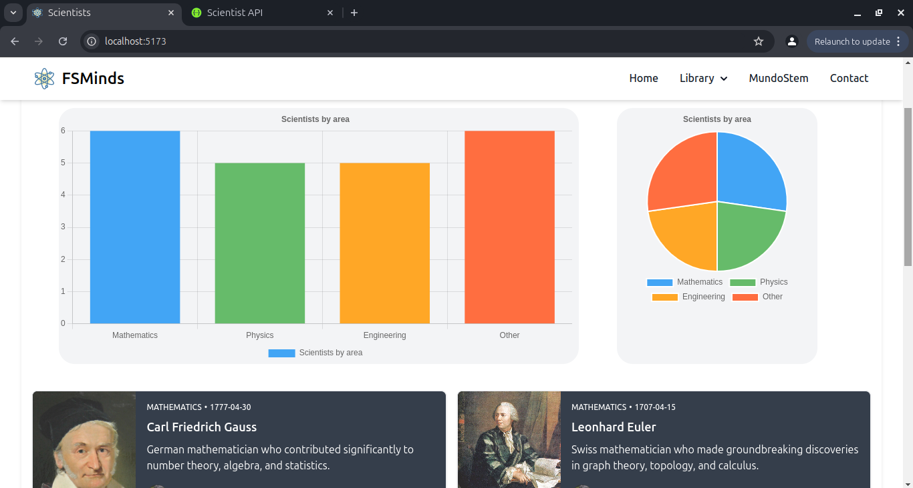

# 🌐 FSMinds Frontend - Execution Instructions

This document provides instructions on how to run the **FSMinds** application. The project uses **PostgreSQL** as the database and is divided into two parts: the backend and the frontend. You can find the backend in the [FSMinds Backend Repository](https://github.com/DavidOlmos03/backend-scientists).


## 🚀 Running the Application

To run the **FSMinds** application, follow these steps carefully. You will need to run both the **backend** and the **frontend** to use the application.

### 🛠 Prerequisites
- Install project dependencies.
   ```bash
   npm install
   ```
---

### ⚙️ Steps to Run

1. **🌐 Start `FSMinds`:**
   ```bash
   npm run dev
2. 📂 Open the application in your browser: Navigate to
   ```bash
   http://localhost:5173/
   ```
---
